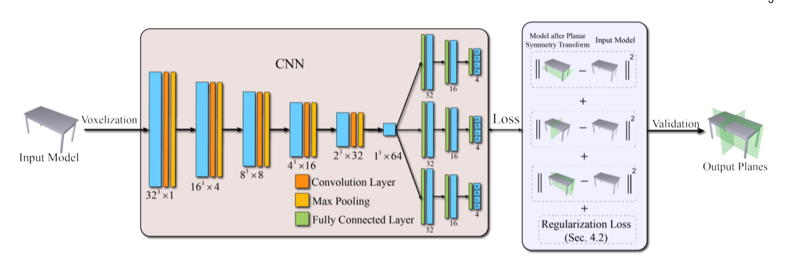

<br><br><br>

# PRS_net in PyTorch

PRS_net is a , which can be used for . This framework includes convolution

 <br>

The code was written by He Yue and this is a self-written one, which is unofficial. Use it carefully, asking the author for official one is the best choice.


# Getting Started

### Installation
- Clone this repo:
```bash
git clone .git
cd PRS_net-master
```
- Install dependencies: [PyTorch](https://pytorch.org/) version 1.2. <i> Optional </i>: [tensorboardX](https://github.com/lanpa/tensorboardX) for training plots.
  
### First Step: GET THE DATASETS 
Download the dataset
(how to make it yourself is revealed below)
```bash
bash ./scripts/shrec/get_data.sh
```
### Second Step: let`s train the model 
Run training
```bash
bash ./scripts/shrec/train.sh
```

### Third Step: let`s test the model with your test object. 
Run test and export the intermediate pooled meshes:
```bash
bash ./scripts/shrec/test.sh
```
### Forth Step: if you wanna (optional)
Visualize the result 
```bash
bash ./scripts/shrec/view.sh
```

An example of planar reflective symmetry detection of 3D object:

 

Note, you can also get pre-trained weights using bash ```./scripts/shrec/get_pretrained.sh```. 

# Citation
If you find this code useful, please consider citing our paper
```
@article{hanocka2019meshcnn,
  title={PRS-Net: Planar Reflective Symmetry Detection Net for 3D Models},
  author={Lin Gao, Ling-Xiao Zhang, Hsien-Yu Meng, Yi-Hui Ren, Yu-Kun Lai, Leif Kobbelt},
  journal={ACM Transactions on Graphics (TOG)},
  volume={38},
  number={4},
  pages = {90:1--90:12},
  year={2019},
  publisher={ACM}
}
```


# Questions / Issues
If you have questions or issues running this code, please open an issue so we can know to fix it.
  
# Acknowledgments
THX FOR ATTENTION.